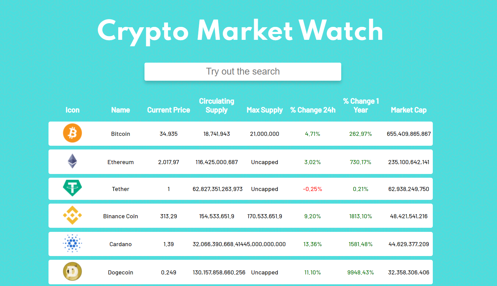

# Crypto Market Watch - API Project

## Overview

An application that works with the CoinGecko Api to display the most important information from the top crypto coins/projects.

Future Developments:  
[] CSV Export Feature 
[] Pagination 
[] Mobile Design Optimization 

### Screenshot

### Links

- Live Site URL: [Live Site](https://jovial-swartz-68f10e.netlify.app/)

## My process

### Built with

- Semantic HTML5 markup
- CSS custom properties
- Axios
- React and React hooks
- Flexbox
- Desktop-first workflow